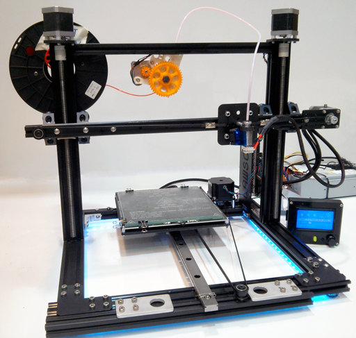
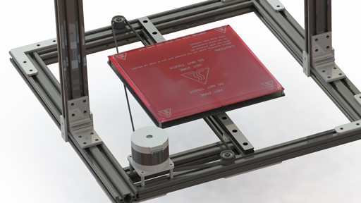
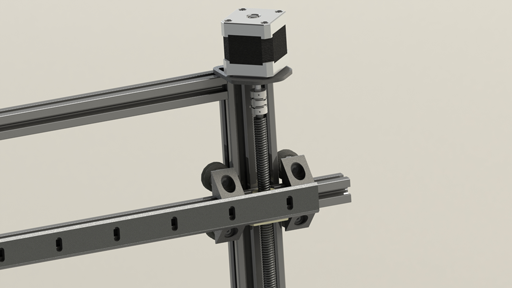
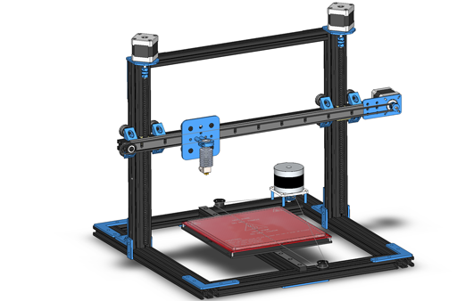
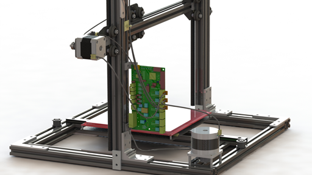

# Lawson-Printer
Open source high precision 3D printer

# Introduction
Lawson is a 3D printer design by [Scott Lawson](https://github.com/scottlawsonbc) featuring excellent linear motion accuracy and a mechanically stiff frame. Compared with the MendelMax 2, Lawson eliminates the need for custom sheet metal, slashes build costs, and improves the linear motion of the X, Y, and Z axes. It is easy to source components for the Lawson printer as 95% of the components can be sourced from only two suppliers.

# Overview

## Design Goals
* High accuracy linear motion
* Mechanically stiff frame
* All printable components have purchasable off-the-shelf counterparts
* Easy to source components. 95% of components available from two suppliers to simplify component sourcing

## Cost
The total build cost of the Lawson printer is approximately $900 USD. This is the price for all components needed to build a working Lawson printer including electronics and [[Stepper motor|motors]]. Build costs can be reduced by approximately $120 USD if printed components are used.

## Component Sourcing
See [Lawson Buyer's Guide](http://reprap.org/wiki/Lawson_Buyers_Guide) for component sourcing information.

To simplify component sourcing, 95% of the components can be obtained from only just two suppliers, Misumi and OpenBuilds Parts Store. The parts that cannot be obtained from these suppliers are:
* Hotend + Extruder
* Heated bed + Glass
* Electronics

This gives users the freedom to easily purchase Lawson components themselves, without needing to go through a middle-man supplier selling a kit. 

## X-axis
The x-axis is a belt driven linear stage powered by a NEMA 17 Stepper motor. The axis is constrained by OpenRail which is screwed into a length of 2020 aluminium extrusion. The x-carriage wheels have eccentric spacers that can be adjusted to prevent excessive friction. The belt tension can be adjusted easily by loosening the belt idler and sliding it left or right on the extrusion. While a direct drive extruder can be used, a bowden feed extruder is reccommended because it significantly reduces the mass of the x-carriage, permitting higher acceleration and speed values and reducing resonance.

## Y-axis

The y-axis is a belt driven linear stage powered by a NEMA 23 Stepper motor and is constrained by a precision Misumi linear slide. Compared to y-axes in other designs such as the MendelMax 2, this triangular belt configuration permits higher speed and acceleration values, reduces component costs, and simplifies construction and maintenance access. The y-axis belt tension can be adjusted by loosening the screws on the NEMA 23 motor and sliding the motor left or right.

The NEMA 23 was selected instead of a NEMA 17 because it permits a simplified mounting configuration and has generally higher performance characteristics.

## Z-axis

The z-axis is a lead screw driven linear stage powered by two NEMA 17 Stepper motor wired in parallel. The z-axis is accurate to ±150 µm over the full travel. The wheels have eccentric spacers that can be adjusted to prevent excessive friction from overconstaint. 

### Comparison to MendelMax 2
The lead screws in the Lawson printer design have the following accuracy specification:
* ±20µm per revolution (due to [thread drunkeness](http://www.deterco.com/tech_info/conversion/helical.htm))
* ±150µm/300mm accumulated pitch error

In comparison, there is no accuracy specification available for the lead screws that the MendelMax 2 design calls for. As such, the accuracy of the MendelMax 2 lead z-axis cannot be guaranteed.

> Unfortunately our lead screws do not have a tolerance specification for these dimensions. These are medium-grade leadscrews, they are better than the cheap screwes[sic] many people use on 3d printers, but they are not comparable to more expensive high end leadscrews. -Mike [from MakersToolWorks]

## Printable Components
Printable components are highlighted in blue

A number of Lawson components can be 3D printed to reduce build costs, with the caveat that printed components are less stiff than their metal counterparts. Unlike many other RepRap printers, *all printable components are purchasable, but not all purchasable components are printable*. This means that printed components are not mandatory and that individuals without access to 3D printers, or individuals who prefer metal components are able to build a Lawson printer. The use of printed components can save up to approximately $120 USD in build costs.

Printable components:
* **Qty:** 2 **Part:** Heavy duty bracket
* **Qty:** 1 **Part:** GT2 Pulley GPA22GT2060-B-H4
* **Qty:** 1 **Part:** Shaft collar
* **Qty:** 4 **Part:** 2-hole Thin bracket HBLSS5
* **Qty:** 2 **Part:** 4-hole bracket HPTSSL5
* **Qty:** 2 **Part:** 8-hole L bracket HPTLD5
* **Qty:** 4 **Part:** 4-hole L bracket HPTLS5
* **Qty:** 2 **Part:** 4-hole T bracket HPTTS5
* **Qty:** 6 **Part:** 2-hole joining plate
* **Qty:** 1 **Part:** 20mm gantry plate
* **Qty:** 8 **Part:** 90deg vslot corner connector
* **Qty:** 2 **Part:** 5mm x 6mm coupler
* **Qty:** 4 **Part:** Belt crimp clamp

## Electronics

Almost all RepRap electronics such can be used to control the Lawson. Electronics confirmed to be working include RUMBA, Printrboard, Generation 7 Electronics, Arduino Mega Pololu Shield, and Rambo.

One option for mounting electronics is the rear side of the z-axis aluminium extrusion. The electronics can be conveniently mounted close to the motors and endstops if mounting is on the same side as the x-axis and y-axis motors. With this configuration, there is easy access to the electronics for wiring any maintenance that may be required.
